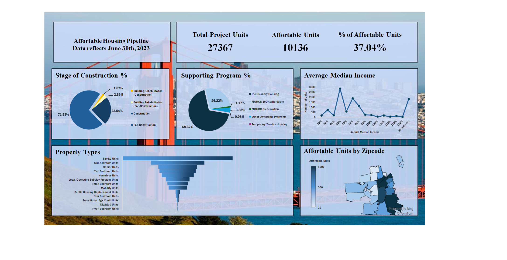
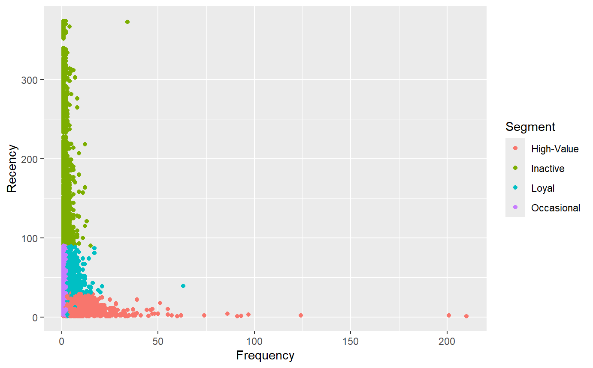
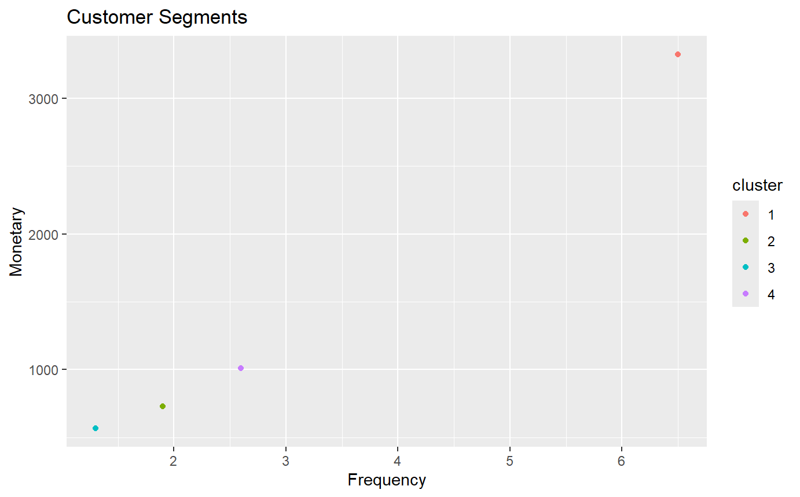
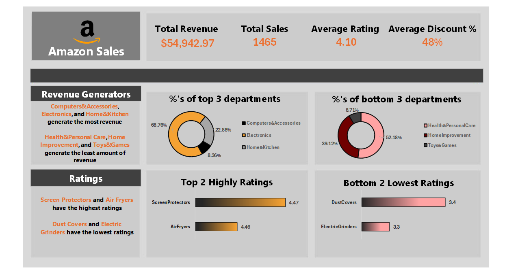

# Nicholas' Portfolio

# Project 1: SF Planning Data Inventory & Governance Project
This project, where I utilized Python to clean and process data from the DataSF Open Data Portal, before transforming findings into a Dashboard in Excel.
* Data was received from the [DataSF Open Data Portal](https://data.sfgov.org/Housing-and-Buildings/Map-of-Affordable-Housing-Pipeline/d4zr-mbcm)
* Code is available in a [Jupyter Notebook](https://github.com/Nicholas-Chavez/SF-Planning-Data-Inventory-Governance-Project/blob/a9b7d6edc360d3768963fc7fb9a2bb01908ecc61/SF%20Planning%20Data%20Inventory%20%26%20Governance%20Project.ipynb)
* Results are displayed in [Excel](https://1drv.ms/x/c/e7e29d8e667b0321/EQl1JkQq7LpErhcC27XZMtcBuHlyg-L60XaCjT7mSuTE1w?e=NXPIj3&nav=MTVfezcwMzdEOURBLUUzMjItNEVENS1CQzU2LTU5MDQ5NjQ0ODVGMn0)

## Dashboard

# Project 2: Customer Churning Analysis

This is a personal project where I cleaned and conducted statistical analysis (e.g., RFM modeling, clustering) to segment 4,000+ customers into distinct behavioral groups: High-Value, Occasional, Churning, and Inactive

* Data was taken from [UC Irvine](https://archive.ics.uci.edu/dataset/352/online+retail) 
* Displayed results on a [slide deck](https://docs.google.com/presentation/d/1fnZu9937KzlCg_g_PX0a-dWMzycuZgSXVSCKSMC7hEI/present?slide=id.g36209d4ed36_0_0) and [Tableau Dashboard](https://public.tableau.com/views/CustomerSegmentation_17471729818720/Dashboard1?:language=en-US&:sid=&:redirect=auth&:display_count=n&:origin=viz_share_link)
* Code available on [github](https://github.com/Nicholas-Chavez/Customer-Segmentation-Analysis/blob/ff833eb3d9a39d1ec8da53d74dbd56a0233bdad9/Customer_Segmentation.qmd)

## Segment Plots

# Project 3: Amazon Sales Metrics

This is a personal project where I cleaned and summarized data in Excel to determine KPIs and selling trends, which was used to create a dashboard.

* Data was taken from an Amazon Sales dataset
* The dashboard displays departments that contribute the most to revenue
* Identifies highly rated and lowest rated products
* This project can be viewed through Excel using this URL: [Excel Sheet](https://1drv.ms/x/c/e7e29d8e667b0321/EVC3wAqMEQpCjActGzqQErsBqA9P62a9a8j7Ij_4q1NeHw?e=3yu1p0)

## Amazon Dashboard

